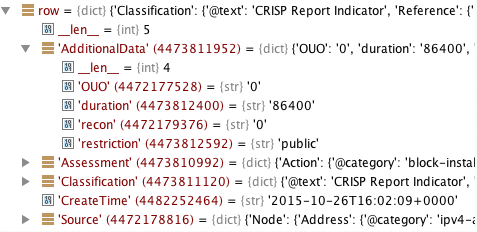
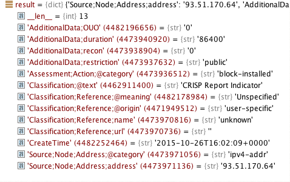
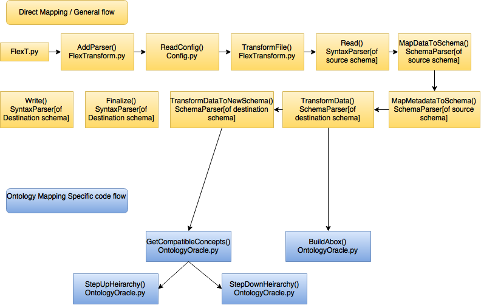

# Developer Documentation  

## Introduction  
Flexible Transform, or *FlexT*, is a tool that enables dynamic translation between formats. Here is an outline of the process logic. The user provides the source file in a specified format, as well as configuration files that have information about the syntax and semantics of the source format and destination format. *FlexT*, then uses ontology logic to map the information contained within the source file source file to the destination format.

Though most of the underlying logic is generic, there are some components of the *FlexT* engine that need to be written separately for each format, which is where the developers come in.  This document is intended to help such developers understand what is required to successfully translate one format into another.  

<figure>
    <a href="FlexTransform/resources/images/dev-figure1.png">
        
    </a>
    <figcaption>
        Figure 1 - Architecture of FlexTransform.
    </figcaption>
</figure>

## Required Inputs  and
- Source File
- Source Format Configuration
- Destination Format Configuration
- Destination File Name & Path

## Configuration File
The configuration files has several sections inside it, which are briefly listed in the list below, with further information provided in the following sections.  Out of these, the SYNTAX and SCHEMA sections are mandatory without which the command will fail. Rest of the sections is optional.  The information inside each section would be in the format of `Attribute = value`. 

- Required Sections
    - Syntax
    - Schema
- At least one of the below sections is required:
    - XMl
    - CSV
    - TSV
    - Regex
    - KeyValue

[Example Configuration File](FlexTransform/resources/sampleConfigurations/cfm13.cfg)

### Syntax 

- FileParser  announces the syntax of the incoming file. It can be XML, JSON, CSV, TSV, REGEX, KEYVALUE, DICT 

### XML

- ValidateSchema defaults to no, set to yes if you want the file validated against the schema

- SchemaFile must be set with the path of the schema xsd file if ValidateSchema is yes

- CustomParser is used to load custom XML parsing classes for complex XML documents. If this field is not set, the generic XML parser is used to parse the source file. If the developer has written a special parser class for the format, the name of the parser needs to be specified here.

### CSV

- HeaderLine defines if the CSV file has the field names in the first non-commented row of the file. HeaderLine defaults to no

- QuotesOptional defines if every field in the CSV file has to be enclosed in quotes. 
 QuotesOptional defaults to yes
- SeparatorChar defines the character or characters that separate the fields in the file
 SeparatorChar defaults to `,`
- StripSpaces defines if spaces before or after the separator should be striped, StripSpaces defaults to yes
- FieldNames have to be defined if HeaderLine is set to no. The FieldNames map to the SCHEMA definition below

### TSV

- HeaderLine defines if the CSV file has the field names in the first non-commented row of the file. HeaderLine defaults to no
- FieldNames have to be defined .The FieldNames map to the SCHEMA definition below

### Regex

- Regex defines the regular expression that needs to be used to parse the input file.
- FieldNames have to be defined . The FieldNames map to the SCHEMA definition below

### KeyValue

- SeparatorChar defines the character or characters that seperate the fields in the file.
- QuoteChar defines the character or characters that encloses the fields in the file.
- KVSeparator defines the character that separates the key from the value in each of the key-value pair. 

### Schema

- PrimarySchemaConfiguration declares the path of the json file that describes the underlying schema for the document for Flexible Transform

- SiteSchemaConfiguration declares the path of the json file that overrides specific values from the primary schema definition. If multiple files are required, separate them with ;

- MetadataSchemaConfiguration Metadata can be included with certain files. Set MetadataSchemaConfiguration to the json file that defines the metadata schema

## Schema Document Definition

Here are some key terminologies to understand before we dive into the detais

- **Field order queue** - The key thing to understand is that whenever we specify a schema definition, a field order is computed. FlexT processes the fields in the input file based on this order.

This file is written in json and has 2 major sections.

- **DocumentHeaderData**
- **IndicatorData**

Under each of these sections, there is a list of fields with attributes and properties.  The list of fields under each section is aggregated inside the “fields” key in the following format. 

```
“FieldName” : {
    “attribute1” : “value1”,  
    “attribute2” : “value2”,  
    “attribute3” : “value3”,
    ...
}
```

Each of these fields have some or all of the following attributes

- **description** – A brief description of the field

- **datatype** – The data type of the field

	Some examples are
	- datetime
	- string
	- ipv4
	- ipv6
	- int
	
	There are some special cases where the value for this attribute has special meaning
	- enum - The field to which the attribute belongs to, would take on values from an enumeration. This enumeration can be specified using the **enumValues** attribute.
	- group - The field to which the attribute belongs to, is the groupID of fields. All the other fields which are part of this group would use this field's json field name as the value for the **memberof** field. This is called as field grouping. When this happens the members of the group are processed before the groupID field. The fields are assigned respective order in the **field order queue**.
	
	
	Samples :

```
Sample 1 : When datatype = enum

"direction": {
				"description": "Direction of traffic flow",
				"datatype": "enum",
				"required": true,
				"ontologyMappingType": "enum",
				"enumValues": {
					"ingress": {
						"ontologyMapping": "http://www.anl.gov/cfm/transform.owl#IngressDirectionSemanticConcept"
					},
					"egress": {
						"ontologyMapping": "http://www.anl.gov/cfm/transform.owl#EgressDirectionSemanticConcept"
					},
				}
			}
			
Sample 2 : When datatype = group

"field1": {
				"datatype": "group",
				..
			},
"field2": {
				"memberof": "field1",
				..
			}
```


		
- **subfields** – This optional attribute is used when **datatype** = "group". This is another variation of field grouping. In Sample 2 above, the fields that are part of a group use **memberof** attribute to denote their membership in the group. Another way is to have the set of fields which are part of this group inside the subfields attribute. **subfields** must be a dictionary and **multiple** attribute needs to be set to True.

	Samples:
	
```			
Sample 3 : subfields

"field1": {
				"datatype": "group",
				"multiple" : "true",
				"subfields": { 
                "reasonList_reasonCategory": {"required":true, "primaryKey":true}, 
                "reasonList_reasonDescription": {"required":false}
				},
				..
		  }
```

- **multiple** – Apart from the use mentioned above, This field is also set to true if there is a possibility of the field taking on multiple values.

- **enumValues** - when **datatype** field is set to "enum", the possible enumerations are present under this attribute as a list. Refer to Sample 1 above.

- **memberof** - Used when **datatype** field is set to "group". Refer to Sample 2 above.

- **defaultValue** – The default value this field would take if the input file does not have a value for this field.
	
	There are some special cases where the value for this attribute has special meaning
	- Begins with a '&' symbol - Means that a transformation function needs to be invoked which will determine the defaultValue for the field in runtime. These transformation functions needs to be defined under the [Transformation functions](FlexTransform/SchemaParser/TransformFunctions) folder. Desired logic needs to be written under the specific format's python file.
	
	Sample :
	

```
Sample 4 : Transformation functions for defaultValue

"report_starttime": {
				"defaultValue": "&CFM13_earliestIndicatorTime()",
				..
			}

This is a field in the file cfm13.json
In order to define the function, you need to head to the FlexTransform/SchemaParser/TransformFunctions/CFM13Functions.py file and define a block with the condition 
if (FunctionName == 'CFM13_earliestIndicatorTime') : 
inside the Execute() method
```


- **ontologyMapping** – The ontology IRI for the field which is a unique identifier for an element in the ontology. 

- **ontologyMappingType** – The type of the underlying ontology mapping. The possible types are

	- simple - Simple one to one mapping between the ontology concept and the field
	- multiple - The field maps to multiple ontology concepts. The IRI of all those concepts are present as a list under **ontologyMappings** attribute
	- enum - Same as **datatype** = "enum". The possible enumerations are present under the **enumValues** attribute and the ontology IRI with it. Refer Sample 1 above.
	- referencedEnum - Same as **datatype** = "enum" but some other field needs to be processed before this field is processed. The name of that field needs to be placed under the **ontologyEnumField** attribute.  Also, the possible enumerations are placed under the **ontologyMappingEnumValues** attribute. This type of model impacts the field order, the field under **ontologyEnumField** will be placed in the field order queue before the referencedEnum field.
	
	Samples :
	
```
Sample 5 : When ontologyMappingType = referencedEnum

"field1": {
				"description": "Direction of traffic flow",
				"datatype": "enum",
				"required": true,
				"ontologyMappingType": "referencedEnum",
				"ontologyEnumField" : "field2"
				"ontologyMappingEnumValues": {
					"ingress": {
						"ontologyMapping": "http://www.anl.gov/cfm/transform.owl#IngressDirectionSemanticConcept"
					},
					"egress": {
						"ontologyMapping": "http://www.anl.gov/cfm/transform.owl#EgressDirectionSemanticConcept"
					},
				}
			}
			
Sample 6 : When ontologyMappingType = simple

"field2": {
				"datatype": "int",
				"ontologyMappingType": "simple",
				"ontologyMapping" : "http://www.anl.gov/cfm/transform.owl#ReportTitleSemanticComponent"
				..
			}
			
Sample 7 : When ontologyMappingType = multiple

"field3": {
				"description": "field3",
				"datatype": "string",
				"ontologyMappingType": "multiple",
				"ontologyMappings" : [
						 "http://www.anl.gov/cfm/transform.owl#UniqueFileIdentifierSemanticConcept",
				 		 "http://www.anl.gov/cfm/transform.owl#UUIDv4DocumentIdentifierSemanticConcept"
				 ]
				..
			}
```

- **ontologyEnumField** - Used when the **ontologyMappingType** = "referencedEnum". The field under **ontologyEnumField** will be placed in the field order queue before the referencedEnum field. Refer Sample 4 above.

- **ontologyMappingEnumValues** - Used when the **ontologyMappingType** = "referencedEnum". Holds all the possible enumerations and their ontology IRIs.

- **required** – Is this a mandatory field? If "yes", then these type of fields will be processed first in the field order queue.

- **requiredIfReferenceField and requiredIfReferenceValuesMatch** -  This field becomes a mandatory field (similar to **required** set to true), if the field under **requiredIfReferenceField** attribute is present in the input file and matches a certain regular expression denoted by the **requiredIfReferenceValuesMatch** attribute. You can specify * under the **requiredIfReferenceValuesMatch** attribute to accept any value.

- **valuemap** – (Only if the input file is in xml syntax) Helps in mapping the field to the relevant element in the xml tree. 

	Consider the following xml file :
	
	```
	<Alert>
    <CreateTime>2015-10-26T16:02:09+0000</CreateTime>
    <Source>
      <Node>
        <Address category="ipv4-addr">
          <address>93.51.170.64</address>
        </Address>
      </Node>
    </Source>
    <Classification text="CRISP Report Indicator">
      <Reference meaning="Unspecified" origin="user-specific">
        <name>unknown</name>
        <url> </url>
      </Reference>
    </Classification>
    <Assessment>
      <Action category="block-installed"/>
    </Assessment>
    <AdditionalData meaning="recon" type="integer">0</AdditionalData>
    <AdditionalData meaning="duration" type="integer">86400</AdditionalData>
    <AdditionalData meaning="restriction" type="string">public</AdditionalData>
    <AdditionalData meaning="OUO" type="integer">0</AdditionalData>
  </Alert>
  
	```
	
	This xml file will be ingested as the below etree object
	
	<figure>
<a href="FlexTransform/resources/images/figure3.png">

</a>
<figcaption>
Figure 3 - E-tree object of the xml file
</figcaption>
</figure>
	
	The method **FlattenDict** in [SchemaParser.py](FlexTransform/SchemaParser/SchemaParser.py) then flattens this dictionary structure into a key-value map structure where the key is the full path to each element in the xml file and value is its corresponding value in the xml file. Take a look below as to how it does that.
	
	<figure>
<a href="FlexTransform/resources/images/figure4.png">

</a>
<figcaption>
Figure 4 - Flattened dictionary
</figcaption>
</figure>
	
	FlexTransform uses this flattened dictionary to map each field in the schema definition document to its respective element in the xml file. Hence the complete path of the xml element that represents a particular field must be given as value to the  **valuemap** attribute.
	
	Samples:

```
Sample 8 : valuemap

For a field that reports the "duration" information inside the Additional data element, valuemap needs to be written as follows.

"report_duration": {
				"description": "duration of the indicator",
				"valuemap" : "AdditionalData;duration"
				..
			}

This ensures that the FlexTransform map the properties of the attribute in the schema document to the respective element in the xml file.

```

- **error** - For testing purposes. When there is a value for this field in the input file, a InvalidSchemaMapping error is thrown

- **ignore** - For testing purposes. If set to true, we ignore this field during processing.

- **discardBeforeTranslation** - Used to have the field dropped after ingest & source mapping, but before translation onto the destination schema. 

- **stripNamespace** - Some schemas included namespace or *other data* in the value of the field, which should be stripped before transformation to the target schema.

	Samples:

```
Sample 9 : stripNamespace

"field1": {
				"stripNamespace": "http://www.anl.gov/cfm/2.0/current/#",
				"required" : "false"
				..
			}

```
- **AdditionalValues** - Multiple values can be assigned to the same field. Along with the input data, the values mentioned under the **AdditionalValues** attribute will be used by FlexT during transformation.

- **regexSplit and regexFields**-  When a value in the source format needs to be split into two or more fields, we use a regular expression to split the input value into desired number of fields and consume it afterwards. The regular expression needed to split the value needs to be specified in the **regexSplit** attribute. The fields that consume the split value needs to be specified under **regexFields** attribute.
	
	Sample:
	
```	
Sample 10 : Contact field in the input file will be split as contact_name, contact_phone and contact_email 

"contact": {
				"description": "Contact name, contact phone, contact email",
				"valuemap": "Analyzer;Node;name", 
				"datatype": "string",
				"required": true,
				"ontologyMappingType": "none",
				"regexSplit": "^([^,]+),\\s*?(?:([-\\(\\)0-9 ]+),\\s*)?([^,]+)?$",
				"regexFields": "contact_name, contact_phone, contact_email",
			}
			
Suppose the input file has the value for contact as

"contact" = "John, 515678787, johndoe@mail.com"
It will be consumed as 
"contact_name" = "John"
"contact_phone" = "515678787"
"contact_email" = "johndoe@mail.com"
```
- **outputFormat and outputFormatCondition** - We can use these attributes when a value in the destination format needs to be constructed from several fields in the source format. The value will be constructed based on the value of **outputFormat** attribute when the condition in the **outputFormatCondition** attribute are met.

	Sample :
	
```
Sample 11 :  outputFormat and outputFormatCondition

"time_taken" : {
				"outputFormatCondition": "[action_duration] > 0",
				"outputFormat": "[assessment_action] for [action_duration] seconds"
				..
			}
			
When the action_duration field has a value greater than zero, The outputFormatCondition will be met.
Hence the value will be constructed using two fields "assessment_action" and "action_duration" as seen above.

```

- **dependsOn** - When this field is dependant on another field to be processed first (by the **field order queue**) , then the dependancy is placed under the **dependsOn** attribute

- **mapOntologyToElement** - This field is used when the ontology mapping of one field must be applied to another.  The **dependsOn** field is required, and using this field forces the **discardBeforeTranslation** field to be *True* 

- **reverseOntologyMapping** - When an IRI required by the destination format is not available in the source format, then it looks for the next best value that possesess the closest semantic meaning as the required concept. This worst case scenario ontologyMappings (more than one can be specified as a list) are placed under the **reverseOntologyMapping** attribute.

	Sample:
	
```
Sample 12 : reverseOntologyMapping
	
	"FilePath Watchlist": {
		"ontologyMapping": 						
				"http://www.anl.gov/cfm/transform.owl#IndicatorCategoryFilePathWatchlistSemanticConcept",
		"reverseOntologyMapping": [
							"http://www.anl.gov/cfm/transform.owl#FilePathIndicatorValueSemanticComponent"
						]
					}
					
	When the concept specified under the ontologyMapping attribute is not present in the incoming file,it looks for next closest matches by looking for the concepts under the reverseOntologyMapping list in the incoming file and takes its value if present.
	
```

- **fields** - The fields specified in the fields attribute can be thought of as dependancies of the current field.The field order is assigned accordingly.


[Example Schema File](FlexTransform/resources/schemaDefinitions/cfm13.json)

## Parser Definition

[Look at the parser modules written for formats such as CFM13,CFM20 and STIX under the directory FlexTransform/SyntaxParser/XMLParsers to get better understanding]

- Read() – The source file needs to be parsed alongside the information available in the schema definition file. A dictionary needs to be created with DocumentHeaderData and IndicatorData as the first level keys and then packing the key-value pairs in the same manner as in the schema definition file. The information about the field to pick up from the source file is present in the schema file. The key is the key of that field in the schema file and the value is the data present in the corresponding field in the source file. This Dictionary is given to the engine for translation 

- Validate_config() - Validate the source data against the schema configuration. Make sure the fields with the required attribute set to true are present in the source file.

- Finalize() - finalize the formatting of data before being sent to the write object. Make sure all the required fields are present

- Write() – Write the data in the form of the destination schema configuration by adhering to the attributes and properties defined.

[Example XML Parser](FlexTransform/SyntaxParser/XMLParsers/CFM13.py)


## Code flow diagram - Direct vs Ontology Mapping

<figure>
<a href="FlexTransform/resources/images/figure2.png">

</a>
<figcaption>
Figure 2 - Code flow diagram
</figcaption>
</figure>

