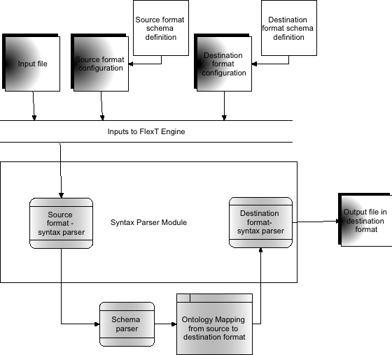

# Developer Documentation

## Introduction  
Flexible Transform, or *FlexT*, is a tool that enables dynamic translation between formats. Here is an outline of the process logic. The user provides the source file in a specified format, as well as configuration files that have information about the syntax and semantics of the source format and destination format. *FlexT*, then uses ontology logic to map the information contained within the source file source file to the destination format.

Though most of the underlying logic is generic, there are some components of the *FlexT* engine that need to be written separately for each format, which is where the developers come in.  This document is intended to help such developers understand what is required to successfully translate one format into another.  

<figure>
    <a href="FlexTransform/resources/images/dev-figure1.png">
        
    </a>
    <figcaption>
        Figure 1 - Architecture of FlexTransform.
    </figcaption>
</figure>

## Required Inputs  
- Source File
- Source Format Configuration
- Destination Format Configuration
- Destination File Name & Path

## Configuration File
The configuration files has several sections inside it, which are briefly listed in the list below, with further information provided in the following sections.  Out of these, the SYNTAX and SCHEMA sections are mandatory without which the command will fail. Rest of the sections is optional.  The information inside each section would be in the format of `Attribute = value`. 

- Required Sections
    - Syntax
    - Schema
- At least one of the below sections is required:
    - XMl
    - CSV
    - TSV
    - Regex
    - KeyValue

[Example Configuration File](FlexTransform/resources/sampleConfigurations/cfm13.cfg)

### Syntax 

- FileParser  announces the syntax of the incoming file. It can be XML, JSON, CSV, TSV, REGEX, KEYVALUE, DICT 

### XML

- ValidateSchema defaults to no, set to yes if you want the file validated against the schema

- SchemaFile must be set with the path of the schema xsd file if ValidateSchema is yes

- CustomParser is used to load custom XML parsing classes for complex XML documents. If this field is not set, the generic XML parser is used to parse the source file. If the developer has written a special parser class for the format, the name of the parser needs to be specified here.

### CSV

- HeaderLine defines if the CSV file has the field names in the first non-commented row of the file. HeaderLine defaults to no

- QuotesOptional defines if every field in the CSV file has to be enclosed in quotes. 
 QuotesOptional defaults to yes
- SeparatorChar defines the character or characters that separate the fields in the file
 SeparatorChar defaults to `,`
- StripSpaces defines if spaces before or after the separator should be striped, StripSpaces defaults to yes
- FieldNames have to be defined if HeaderLine is set to no. The FieldNames map to the SCHEMA definition below

### TSV

- HeaderLine defines if the CSV file has the field names in the first non-commented row of the file. HeaderLine defaults to no
- FieldNames have to be defined .The FieldNames map to the SCHEMA definition below

### Regex

- Regex defines the regular expression that needs to be used to parse the incoming file.
- FieldNames have to be defined . The FieldNames map to the SCHEMA definition below

### KeyValue

- SeparatorChar defines the character or characters that seperate the fields in the file.
- QuoteChar defines the character or characters that encloses the fields in the file.
- KVSeparator defines the character that separates the key from the value in each of the key-value pair. 

### Schema

- PrimarySchemaConfiguration declares the path of the json file that describes the underlying schema for the document for Flexible Transform

- SiteSchemaConfiguration declares the path of the json file that overrides specific values from the primary schema definition. If multiple files are required, separate them with ;

- MetadataSchemaConfiguration Metadata can be included with certain files. Set MetadataSchemaConfiguration to the json file that defines the metadata schema

## Schema Document Definition

This file is writtein in json and has 2 major sections

- **DocumentHeaderData**
- **IndicatorData**

Under each of these sections, there is a list of fields with attributes and properties.  The list of fields under each section is aggregated inside the “fields” key in the following format

```
“FieldName” : {
    “attribute1” : “value1”,  
    “attribute2” : “value2”,  
    “attribute3” : “value3”,
    ...
}
```

Each of these fields have some or all of the following attributes

- Description – A brief description of the field

- Datatype – The data type of the field

- DefaultValue – The default value this field would take if the incoming file does not have a value for this field.

- OntologyMapping – The RDF file that specifies the ontology mapping for the format

- OntologyMappingType – The type of the underlying ontology mapping

- Required – Is this a mandatory file?

- Valuemap – (only if the incoming file is in xml syntax) map to find the field in the xml tree

- Subfields – Does the field have any subfields associated with them. If so, list them along with their attributes

- Multiple – Does this field take multiple values?

- Memberof – is this field a member of any other field present in the schema definition, if so then give its name

- EnumValues – an enumeration of legal values this field can take

[Example Schema File](FlexTransform/resources/schemaDefinitions/cfm13.json)

## Parser Definition

[Look at the parser modules written for formats such as CFM13,CFM20 and STIX under the directory FlexTransform/SyntaxParser/XMLParsers to get better understanding]

- Read() – The source file needs to be parsed alongside the information available in the schema definition file. A dictionary needs to be created with DocumentHeaderData and IndicatorData as the first level keys and then packing the key-value pairs in the same manner as in the schema definition file. The information about the field to pick up from the source file is present in the schema file. The key is the key of that field in the schema file and the value is the data present in the corresponding field in the source file. This Dictionary is given to the engine for translation 

- Validate_config() - Validate the source data against the schema configuration. Make sure the fields with the required attribute set to true are present in the source file.

- Finalize() - finalize the formatting of data before being sent to the write object. Make sure all the required fields are present

- Write() – Write the data in the form of the destination schema configuration by adhering to the attributes and properties defined.

[Example XML Parser](FlexTransform/SyntaxParser/XMLParsers/CFM13.py)



