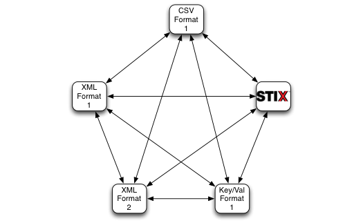

Flexible Transform
=====

* [Quick Start](qs)
* Overview
* Installing
* Use and testing
* Architecture
* Configuration File Details
* Ontology Overview

Quick Start Guide
--------

Overview
--------
*The problem* 

Most cyber defense systems incorporate some form of cyber threat intelligence (CTI) collection and analysis.  However, different systems and CTI sharing communities have implemented a variety of representations to transmit this data (e.g. STIX, OpenIOC, custom CSV). This presents a challenge when an organization using one format has the opportunity to join sharing communities where the members share data in different formats.  Similarly, merging communities with different CTI formats can seem nearly insurmountable, and proceeds at the pace of the slowest member in each community to adopt a different format.  

While simple translators can be written to convert data from one format to another, challenges to this approach include:

- An exponential increase in the effort required to support new formats
- Potential loss of meaning and context (semantics) between formats.

These challenges lead to islands of sharing defined not by communities, but by sharing formats, leaving smaller organizations unable to participate at all, isolated and defenseless.

*The solution*

Flexible Transform (FlexT) is a tool that enables dynamic translation between formats. FlexT accomplishes this by digesting CTI data down to its semantic roots (meaning and context). As seen in Figure 1, making this the core of the translation simplifies the process. This allows the use of new formats with improved scalability and ensures that the original meaning and context of CTI data is preserved.

<figure>

<figcaption>
Figure 1 - On the left, the scaling problem with developing pairwise translators for all supported formats.  On the right, the advantage of using an intermediate semantic representation.
</figcaption>
</figure>

A "format" in FlexT is broken down into three components:

- **Syntax** - A specification of valid document characters and their composition, e.g. CSV, XML, JSON.
- **Schema** - A specification of the valid terms, the data they can convey, and restrictions on their use, e.g. STIX, OpenIOC, IODEF.
- **Semantics** - A definition of the meaning of terms, e.g. SourceIPAddress is the session originating IPv4 address.

Using FlexT, organizations are empowered to participate in sharing communities using any type of CTI, in any format.  When coupled with a toolset such as CFM's Last Quarter Mile Toolset (LQMToolset), participants can not only share and ingest, they can take automated action based on that intelligence with an array of security endpoint devices. 

*Features*

- **Multiple interfaces**: Use FlexT as a library or from the command-line tool
- **Accurate translation**: Convert the format without losing context or meaning
- **Easy extensibility**: To support a new schema, simply define a mapping JSON file and immediately convert to/from any other supported format

Currently Supports:

- Structured Threat Information eXpression (STIX)  with multiple profiles 
- All CFM XML schemas 
  - CFM 1.3 Legacy Format
  - CFM 2.0 Format
- Key/Value indicator schema

Coming Soon:

- Additional Data Formats
  - OpenIOC
  - FlexText 
- REST Web-based interface

*Get Involved*
There are many threat indicator formats to use, and many organizations have "grown their own".  Feel free to test out FlexT and provide feedback, submit code, or develop and share JSON configuration files.

Get involved and help turn CTI into actionable defense! Contact us via <a href="mailto:CFMteam@anl.gov">CFMteam@anl.gov</a>

Use and testing
---------
Sample files are provided to test FlexT both in terms of unit testing as well as ensuring that it is installed correctly.  These tests can be run individually as follows:

> Usage:

    FlexTransform.py [-h] --src-config CONFIG \
                          --src SRC \
                          [--src-metadata SRC_METADATA] \
                          --dst-config CONFIG \
                          --dst DST \
                          [--tbox-uri TBOX_URI] \
                          [--source-schema-IRI SOURCE_SCHEMA_IRI] \
                          [--destination-schema-IRI DESTINATION_SCHEMA_IRI]

Taking a closer look at the command line structure:

* src-config CONFIG -- Use CONFIG for source syntax, schema, and other parameters
* src SRC -- The source file to read data from 
* src-metadata SRC_METADATA -- OPTIONAL - If additional metadata (e.g. handling, etc.) is required beyond what is available in SRC, specify the source of that data here.
* dst-config CONFIG -- Use CONFIG for destination syntax, schmea, and other parameters
* dst DST -- The location to write the destination file to
* tbox-uri TBOX_URI -- OPTIONAL The location of the ontology source -- if not specified, no hierarchical semantic matching will be performed.
* source-schema-IRI SOURCE_SCHEMA_IRI -- OPTIONAL,DEPRECATED - In the future will be specified in the config file
* destination-schema-IRI SOURCE_SCHEMA_IRI -- OPTIONAL,DEPRECATED - In the future will be specified in the config file

An example execution might be:

    python3 FlexTransform.py \
        --src-config resources/sampleConfigurations/cfm13.cfg \
        --src resources/sampleMessages/cfm13Uploads/WithMetadata/anl.Alert.Cfm13Alert \
        --src-metadata resources/sampleMessages/cfm13Uploads/WithMetadata/.anl.Alert.Cfm13Alert \
        --dst-config resources/sampleConfigurations/cfm13_nrel.cfg \
        --dst resources/testing/dst13to13nrelwithMeta.xml \
        --tbox-uri resources/test.owl

The above would transform the cfm13 formatted document (anl.Alert.Cfm13Alert) into a variation of the format in use by nrel and write the result to resources/testing/dst13to13nrelwithMeta.xml.  Additional metadata will be read from .anl.Alert.Cfm13Alert (note the <dot>).  The ontology schema definitions in resources/test.owl would be used for hierarchical inference.

Architecture
---------

Configuration File Overview
---------
The execution of FlexT is controlled via command-line arguments and configuration files (.cfg).
An overview is provided here; for details see the comments in the sample configuration (resources/sampleConfigurations/format.cfg.sample).

The configuration file is comprised of several sections including:

* SYNTAX -- This indicates the syntax parser(s) supported by this execution.  Examples include XML, CSV, REGEX, and other document representational structures.
* <SYNTAX SPECIFIC Options> -- Depending on the syntax(es) selected above, one or more syntax-specific sections provide details to the syntax parsers on how to digest/produce documents.  For example, a CSV file may or may not have a header line, may treat quotes as optional or required, and may or may not strip spaces.
* SCHEMA -- The schema section indicates the schema definition files that should be applied to the document along with metadata schema configuration if required.

*Example config file*

*Example metadata file*

*Example JSON schema file*

Ontology Overview
---------
